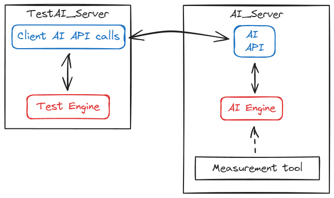
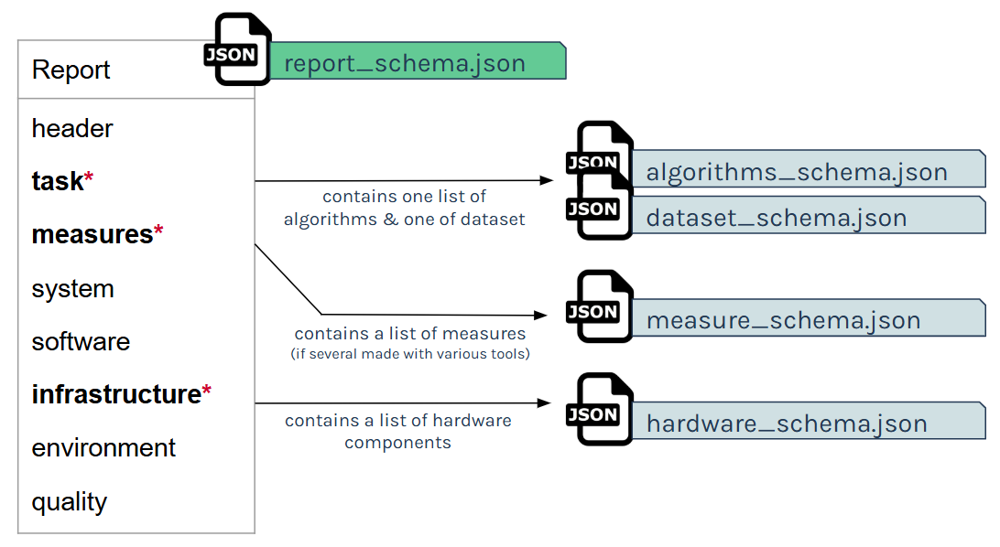

This energy report format is published under Creative Commons 4.0.
https://creativecommons.org/licenses/by/4.0/

# Reporting of the AI's energy consumption

Welcome to our README for Boamps !

With few words Boamps is : 
- A datamodel to report energy consumption of AI/ML models
- A OpenData linked with it [HERE](https://huggingface.co/datasets/boavizta/BoAmps_data) to store that generated data (first temporary test repo)
- Some tools to help fill the datamodel and validate it ([HuggingFace tools](https://huggingface.co/spaces/boavizta/BoAmps_report_creation), 
bash and excel tool)
  
  
You should find here all the information that you want/need to :

## Table Of Content

- [Reporting of the AI's energy consumption](#reporting-of-the-ais-energy-consumption)
  - [Table Of Content](#table-of-content)
  - [0. Version](#0-version)
  - [1. Goals](#1-goals)
  - [2. Who could participate ?](#2-who-could-participate-)
  - [3. Energy Measurement](#3-energy-measurement)
    - [Software-based](#software-based)
    - [Hardware-based](#hardware-based)
  - [4. How and What is to measure ?](#4-how-and-what-is-to-measure-)
    - [Simple system](#simple-system)
    - [Complex system with API](#complex-system-with-api)
    - [The Calibration process](#the-calibration-process)
    - [For ideals measurements](#for-ideals-measurements)
  - [5. Understand the data model](#5-understand-the-data-model)
    - [Global structure](#global-structure)
    - [Guidelines to create valuable report](#guidelines-to-create-valuable-report)
  - [6. State-of-the-art](#6-state-of-the-art)
    - [On ML tasks categorization](#on-ml-tasks-categorization)
    - [On ML description frameworks](#on-ml-description-frameworks)
  - [7. The tools](#7-the-tools)
    - [Schema validator](#schema-validator)
    - [Json Generator](#json-generator)
  - [8. Roadmaps :](#8-roadmaps-)
    - [For the datamodel](#for-the-datamodel)
    - [For the open Data space](#for-the-open-data-space)
    - [For the datamodel tools](#for-the-datamodel-tools)
  - [Let's GO](#lets-go)

## 0. Version

As release in main branch, you will find : 
 - The last version of the datamodel
 - Some tools that are not yep adpated to the last format of the datamodel (Work In progress) 

## 1. Goals

We have two main goals : 
- First one is to standardize the way of reporting energy consumption of ML/AI models by creating a datamodel in json. (This Repo)
- Second one is to build a large, open, database of energy consumption of IT / AI tasks depending on data nature, algorithms, hardware, etc., in order to improve energy efficiency approaches based on empiric knowledge. Of course based on this datamodel (See our first test version on HuggingFace [HERE](https://huggingface.co/datasets/boavizta/BoAmps_data))

Why ?  
- Globally it is to setup a simple and resilient digital ecosystem, so as to gather homogeneous, well-formated measures of energy consumption from an atomic software task in general and Machine Learning / Deep Learning / AI / GenAI tasks in particular.
- More concretely, this knowledge may be used in applied research to improve frugal approaches in AI and avoid energy-intensive tasks, know more about ML/AI models consumption...

So to ensure that this base is solid and useful, please read carefully the documentation so that everyone can take comparable measurements.

## 2. Who could participate ? 

Anyone who runs machine learning models of any kind can use the model and contribute to the dataset. 
You just need to set up a measurement tool to be able to measure the energy consumption of your machine learning algorithms.
Our model and the associated tools will enable you to turn energy consumption into very valuable data.
The teams have made all effort to ease the generation process but still a bit of work is required.

## 3. Energy Measurement

It is assumed that the measurement of an atomic task can be achieved by one or several means among the following.

### Software-based 
- CodeCarbon
- Carbon AI
- PyJoules
- PowerGadget
- ...

### Hardware-based 
- Direct physical measure with a Watt-meter.

## 4. How and What is to measure ?

### Simple system 

Here is some example on where to put your measurement tool depending of the virtualized infrastructure (VM or Container) you have and capabilities :

Here is the same around the physical machine :

### Complex system with API
I have an API server which provide interfaces to my AI/ML model.

The ideal condition is to measure the energy consumption of both the server (where your AI is deployed) and the client that queries the AI.
If the ideal case is not possible, prefer measurements on the AI side because we mainly want to measure the AI model's consumption and not your test tools or scripts. 

### The Calibration process

If possible, please make one (or more) calibration measurement and provide it on your report (there are appropriate fields to do it in the measure_schema.json). It allows to seperate the consumption of your machine that is related to your actual ml task from its initial consumption. This is especially necessary when the machine is already being used for another power-hungry task.

### For ideals measurements

You will find below a description of recomendations :
- A tool that is compatible with your components (CPU, GPU etc) to avoid as much as possible constant mode (when the energy consumption of your components has been calculated with a constant as a function of execution time).
- Have nothing else than the model launched on the machine to not disturb the measure (close all you other windows and apps), if you can't, reduce cross-functional activities to the minimum possible.
- Calibration : measure the consumption of your machine during few minutes before and after you launch your model to be aware of your initial consumption and fill it in your report.
- Try to fill in as many applicable fields as possible in your report.

We know that this ideal conditions are not easy to assemble, so we let you provide a lot of different configurations but it is very important that you give us the maximum information about your condition of run and your methodology of measure.

## 5. Understand the data model

### Global structure

The report_schema.json is the main file and it makes reference to few sub schemas : algorithm_schema.json, dataset_schema.json, measure_schema.json & hardware_schema.json. 

Here is a diagram of the sections of the report and the links with the file names :

It might seem like a lot of information to fill in, but the only mandatory parts are in bold with the asterisk. Inside these main parts, there are a lot of optional parameters to adapt to a wide variety of configurations. 

### Guidelines to create valuable report

The datamodel is complex and allows to describe a lot of different configurations: for example, you can provide the description of as many dataset or hardware components that you want. However, it is important to bear in mind that the more precise the report, the more useful the information will be. For example, if you simply say that you performed 10000 inferences on different images of various sizes, using a supervised algorithm, that you were on the cloud and that you consumed x kWh, this will not allow you to deduce much information about the cost of an inference on a specific piece of data on a specific hardware. It is better to produce reports on a finer scale: I've run this recognition algorithm, I've measured the power consumption of the cpu and gpu of this model, I have made an inference about an image of this certain size...    

Read the schema carefully: some attributes are enumerations with detailed possible values, others are free fields. When this is the case, please describe things in a unique and unambiguous way to facilitate processing. We ask you to use the [camelCase](https://en.wikipedia.org/wiki/Camel_case) notation (e.g don't write "Random forest" or "Random_forest" but "randomForest" instead).

## 6. State-of-the-art 

To create this datamodel, we based ourselves on these references:

### On ML tasks categorization

- https://www.researchgate.net/publication/320609700_A_Review_on_Machine_Learning_Algorithms_Tasks_and_Applications
- https://vitalflux.com/7-common-machine-learning-tasks-related-methods/
- https://pythonprogramminglanguage.com/machine-learning-tasks/
- https://accessibleai.dev/post/coremltasks/
- https://www.c-sharpcorner.com/article/a-quick-overview-of-machine-learning-tasks/

### On ML description frameworks

These could typically inspire the ground for a format of reporting.
- https://hdsr.mitpress.mit.edu/pub/zkib7xth/release/2
- https://www.iso.org/standard/74438.html
- https://standards.ieee.org/ieee/3123/10744/

## 7. The tools

### Schema validator

The validate-schema.py script (in the folder 'tools>schema_validator') allows you to validate that the json you have created correctly follows the schema we have defined (in the folder 'model').

We provide you with few examples to understand how to create a report by following the schema correctly (in the folder '../../examples').
The script validate-schema.py allows you to check that your report follows the format correctly, and if it doesn't, it details the errors so that you can easily correct them.

To use it, you need to have Python installed, as well as the modules described in the requirements.txt document.

Then, you just need to run : python validate-schema.py <json-report-name>

For example :  python validate-schema.py ..\..\examples\energy-report-example-1.json

### Json Generator

To make the use of this data model easier and more efficient, we want to develop some tools that automates the report creation, to automate the conversion into format usable by datalakes and quick displays. This in multiple formats and languages like Excel with VBA, bash script and python. These tools are useful for understanding the datamodel more easily and filling it in more quickly, but input remains manual.   
 However, we also want to develop a tool that automates the report creation to make it easier and more efficient. Initially, it would be a prototype overlaying CodeCarbon (started at the Boavizta hackathon of May 2024 in the folder 'tools>automated_report_creation'). To be continued...

## 8. Roadmaps :

### For the datamodel 

### For the open Data space

The final objective is to create an open dataset (probably hosted on hugging face) so that anyone can share his consumption data about any task of ML with the whole community. It will help us to understand better what influences consumption and how we can better predict and manage it, in particular by extending tools such as ecologits. To be continued...

### For the datamodel tools

The final objective is to create an open dataset (probably hosted on hugging face) so that anyone can share his consumption data about any task of ML with the whole community. It will help us to understand better what influences consumption and how we can better predict and manage it, in particular by extending tools such as ecologits. To be continued...

## Let's GO 
Thanks for your attention and your intention to measure the consumption of AI. It is an essential step into better knowledge about the impacts of these models.
